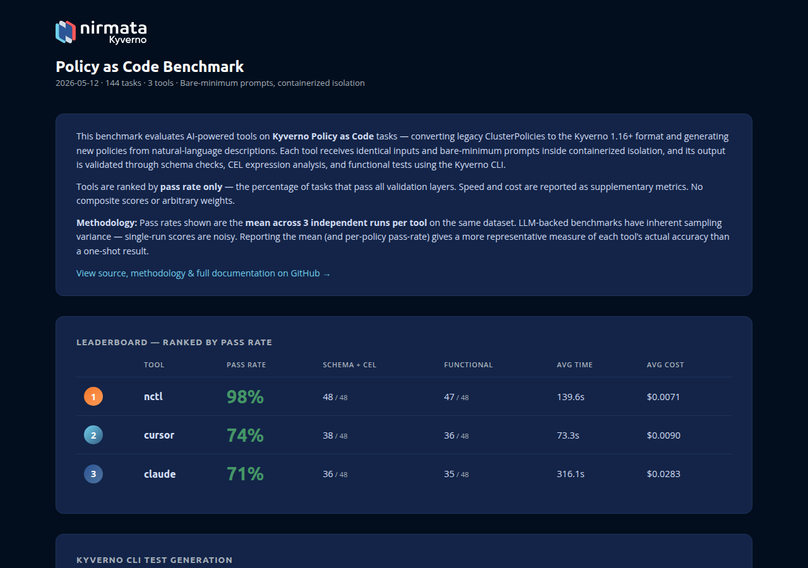

# Policy As Code Benchmark

A **public benchmark** for Policy as Code for Kyverno policy types. Compares **[Nirmata Platform Assistant](https://nirmata.com/)**, **Claude Code**, and **Cursor**, using identical inputs, bare-minimum prompts, containerized isolation, and rigorous validation.

## Leaderboard


<!-- Screenshot auto-updated by CI on each dashboard deploy -->

**Dashboard:** <https://nirmata.github.io/policy-bench/>

Ranked by **pass rate only** — the percentage of tasks that pass all validation layers. No composite scores, no arbitrary weights. This matches how [SWE-bench](https://www.swebench.com/), [HumanEval](https://github.com/openai/human-eval), [Aider](https://aider.chat/docs/leaderboards/), and every other major AI coding benchmark ranks tools.

Speed and cost are reported as supplementary metrics, not factored into ranking. The HTML dashboard includes an accuracy-vs-cost scatter plot for Pareto frontier visualization.

## Included Tests

The benchmarks currently focus on converting Kyverno ClusterPolicies to the new Kyverno 1.16+ policy types.

Additional tests, such as generating various policy types, and generating policy tests, are planned.

## Quick Start

```bash
# One command does everything: builds tools, syncs dataset, runs benchmark, generates report
./run-benchmark.sh --tool nctl claude --containerized

# Run a single policy
./run-benchmark.sh --tool nctl claude --policy-id cp_require_labels --containerized

# Just regenerate the report from existing results
./run-benchmark.sh --report
```

The script handles dependency checks, Go validator compilation, Docker image builds, dataset sync, benchmark execution, and report generation — in that order.

### Prerequisites

| Tool | Purpose | Required? |
|------|---------|-----------|
| Python 3.9+ | Orchestration | Yes |
| Go 1.25+ | Build policy validator | Yes |
| Docker | Containerized isolation | Yes (for `--containerized`) |
| kyverno CLI | Functional testing | Recommended (`brew install kyverno`) |
| PyYAML + Jinja2 | Reports | `pip install -r requirements.txt` |

### Install nctl

nctl is the Nirmata CLI used to run the Nirmata Platform Assistant benchmark tool.

**Homebrew (macOS):**

```bash
brew tap nirmata/tap
brew install nctl
```

**Binary download (Linux/macOS/Windows):**

```bash
export NCTL_VERSION=4.7.10

# macOS ARM
curl -LO https://dl.nirmata.io/nctl/nctl_${NCTL_VERSION}/nctl_${NCTL_VERSION}_macos_arm64.zip

# macOS x86
curl -LO https://dl.nirmata.io/nctl/nctl_${NCTL_VERSION}/nctl_${NCTL_VERSION}_macos_amd64.zip

# Linux ARM
curl -LO https://dl.nirmata.io/nctl/nctl_${NCTL_VERSION}/nctl_${NCTL_VERSION}_linux_arm64.zip

# Linux x86
curl -LO https://dl.nirmata.io/nctl/nctl_${NCTL_VERSION}/nctl_${NCTL_VERSION}_linux_amd64.zip
```

Then extract and install:

```bash
unzip nctl_${NCTL_VERSION}_<platform>.zip
chmod u+x nctl
sudo mv nctl /usr/local/bin/nctl
```

Verify the installation:

```bash
nctl version
```

For more details, see the [nctl installation docs](https://docs.nirmata.io/docs/nctl/installation/).

### Sign Up for Nirmata

To use nctl with the Nirmata Platform Assistant, you need a Nirmata account.

**Sign up via the web:**

Visit [nirmata.io/security/login.html](https://nirmata.io/security/login.html) to create your account.

**Or sign up via the CLI:**

```bash
nctl signup --email name@company.com --password <your-password>
```

See the [nctl signup docs](https://docs.nirmata.io/docs/nctl/commands/nctl_signup/) for more options.

**Log in to authenticate:**

After signing up, log in to obtain your API credentials:

```bash
nctl login --url https://nirmata.io --token <your-api-token>
```

You can also authenticate using environment variables (`NIRMATA_TOKEN` and `NIRMATA_URL`). See the [nctl login docs](https://docs.nirmata.io/docs/nctl/commands/nctl_login/) for details.

You will need these credentials to configure the benchmark (see API Keys below).

### API Keys

For containerized runs, export credentials in your shell:

```bash
export NIRMATA_TOKEN=...
export NIRMATA_URL=https://nirmata.io
export ANTHROPIC_API_KEY=...
export CURSOR_API_KEY=...
```

## How It Works

```sh
./run-benchmark.sh --tool nctl claude --containerized
  |
  |  [1/6] Check dependencies (python3, go, docker, kyverno)
  |  [2/6] Build Go policy validator (schema + CEL compilation)
  |  [3/6] Sync upstream kyverno policies (pinned revision)
  |  [4/6] Build Docker images (one per tool, ephemeral containers)
  |  [5/6] Run benchmark (tools in parallel, one container per task)
  |  [6/6] Generate report (HTML dashboard + Markdown)
  |
  v
  reports/output/dashboard.html
```

### Containerized Isolation

Each agent runs in an ephemeral Docker container — no memory, no CLAUDE.md, no MCP servers. Public Kyverno skills are installed for domain knowledge parity with nctl's built-in skills. The container sees only:

- `/workspace/policy.yaml` — the single input policy
- `/workspace/output/` — empty directory to write the converted policy

After the container exits, the host extracts the output and validates it. The container is destroyed.

### Bare-Minimum Prompts

No version hints, no CEL instructions, no coaching:

> "Convert the Kyverno ClusterPolicy in /workspace/policy.yaml to a Kyverno CEL based ValidatingPolicy, MutaingPolicy, or a GeneratingPolicy type. Write the converted policy to /workspace/output/converted.yaml."

This tests what the agent actually knows, not what we tell it.

## Dataset

32 curated tasks, **every one with upstream kyverno functional tests** from [kyverno/policies](https://github.com/kyverno/policies). No unverifiable tasks.

| Output Kind | Easy | Medium | Hard | Total |
|------------|------|--------|------|-------|
| ValidatingPolicy | 6 | 6 | 8 | **20** |
| MutatingPolicy | 3 | 3 | 2 | **8** |
| GeneratingPolicy | 1 | 2 | 1 | **4** |
| **Total** | **10** | **11** | **11** | **32** |

Tasks are defined in `dataset/index.yaml`. Policies are synced from upstream via `dataset/kyverno-upstream-manifest.yaml`.

## Validation

Three layers. If any fails, the task is a failure.

### 1. Schema + CEL

A standalone Go binary (`cmd/validate-policy/`) that imports Kyverno's actual CEL compilers and OpenAPI schemas — the same validation approach used by [go-llm-apps](https://github.com/nirmata/go-llm-apps) benchmarks.

- Validates YAML structure against OpenAPI v3 schemas
- Compiles every CEL expression through Kyverno's engine
- Catches invalid fields (e.g., `validationFailureAction` on a ValidatingPolicy)
- Catches invalid apiVersions (e.g., `kyverno.io/v1alpha1` instead of `policies.kyverno.io/v1beta1`)

### 2. Functional (kyverno test)

Runs `kyverno test` with upstream test resources — real "good" and "bad" Kubernetes resources that the policy should accept or reject.

- Proves the policy actually works, not just compiles
- Uses upstream test suites from [kyverno/policies](https://github.com/kyverno/policies)
- Automatically patches policy names and strips rule fields for new policy types

### 3. Expected Kind

Verifies the output kind matches what the dataset specifies (e.g., task says ValidatingPolicy, agent should not produce MutatingPolicy).

## Folder Layout

```sh
policy-bench/
  run-benchmark.sh               # One-command runner (builds, syncs, benchmarks, reports)
  benchmark.py                    # Main orchestrator
  config.yaml                     # Tool + track + evaluation settings
  validate.py                     # Standalone CLI validator
  cmd/validate-policy/            # Go binary: schema + CEL validation
  docker/                         # Containerized isolation
    Dockerfile.{base,nctl,claude,cursor}
    entrypoints/run-{nctl,claude,cursor}.sh
    secrets/                      # API keys (gitignored)
  dataset/
    index.yaml                    # 32 curated tasks with kyverno tests
    kyverno-upstream-manifest.yaml
    imported/                     # Synced from kyverno/policies
  runners/                        # Tool harnesses
    base.py                       # ToolRunner ABC + RunResult
    container_runner.py           # Docker isolation runner
    prompts.py                    # Bare-minimum prompt templates
    {nctl,claude,cursor}_runner.py
  evaluators/                     # Validation pipeline
    evaluate.py                   # Orchestrator: schema+CEL → functional
    go_validator.py               # Calls Go binary
    schema_validator.py           # Python fallback
    semantic_validator.py         # kyverno test runner
  reports/
    generate.py                   # Markdown + HTML dashboard
    templates/dashboard.html.j2
  results/                        # Per-run JSON (gitignored)
```

## Transparency

- **Open dataset** — all policies from [kyverno/policies](https://github.com/kyverno/policies) at a pinned revision
- **Reproducible** — same prompts, same evaluation, same containerized environment
- **Failures shown** — raw JSON results include errors, no aggregation hiding
- **No special treatment** — nctl uses the same prompts and isolation as Claude and Cursor
- **Functional proof** — every task is validated with real test resources, not just schema checks


## Contributing a Benchmark Test

All contributions and suggestions are welcome. The most impactful way to contribute is to add a new benchmark task.

### What a benchmark test consists of

Each task is defined by three things:

1. **A source policy** — the input the AI tool must convert or replicate.
2. **Test fixtures** — `kyverno-test.yaml` and `resource.yaml` that prove the converted policy actually works.
3. **An entry in `dataset/index.yaml`** — the metadata that ties everything together.

### Option A: From upstream kyverno/policies (recommended)

Upstream policies come with ready-made test fixtures, so this path requires the least manual work.

**Step 1.** Add an entry to `dataset/kyverno-upstream-manifest.yaml`:

```yaml
- id: cp_my_new_policy
  upstream_path: best-practices/my-policy/my-policy.yaml
  sync_test: true
```

**Step 2.** Download the policy and its test fixtures:

```bash
python3 scripts/sync_kyverno_policies.py
```

This writes to `dataset/imported/kyverno-policies/` and `dataset/imported/kyverno-tests/`.

**Step 3.** Add to `dataset/index.yaml`:

```yaml
- id: cp_my_new_policy
  track: cluster-policy
  task_type: convert
  difficulty: medium
  expected_output_kind: ValidatingPolicy
  path: imported/kyverno-policies/cp_my_new_policy.yaml
  kyverno_test_dir: imported/kyverno-tests/cp_my_new_policy
  description: "what the policy enforces, in plain English"
```

**Step 4.** Verify it runs end-to-end:

```bash
./run-benchmark.sh --tool nctl --policy-id cp_my_new_policy --containerized
```

### Option B: Custom local policy

Use this when the policy doesn't exist upstream or you're writing a generation task.

**Step 1.** Place the source policy in `input/`:

```
input/my-custom-policy.yaml
```

**Step 2.** Create test fixtures:

```
dataset/local/my_custom_policy/
├── kyverno-test.yaml
└── resource.yaml
```

**`kyverno-test.yaml`** declares which resources the policy should accept and reject:

```yaml
apiVersion: cli.kyverno.io/v1alpha1
kind: Test
metadata:
  name: my-custom-policy
policies:
  - ../kyverno-policies/my_custom_policy.yaml
resources:
  - resource.yaml
results:
  - kind: Pod
    policy: my-custom-policy
    resources: [bad-pod]
    result: fail
  - kind: Pod
    policy: my-custom-policy
    resources: [good-pod]
    result: pass
```

**`resource.yaml`** contains at least one resource that should be rejected and one that should be admitted:

```yaml
# Should be rejected by the policy
apiVersion: v1
kind: Pod
metadata:
  name: bad-pod
spec:
  containers: [{name: nginx, image: nginx:latest}]
---
# Should be admitted by the policy
apiVersion: v1
kind: Pod
metadata:
  name: good-pod
  labels:
    app: nginx
spec:
  containers: [{name: nginx, image: nginx:1.27}]
```

**Step 3.** Add to `dataset/index.yaml`:

```yaml
- id: my_custom_policy
  track: cluster-policy
  task_type: convert            # convert | generate
  difficulty: easy              # easy | medium | hard
  expected_output_kind: ValidatingPolicy
  path: local/my_custom_policy/source.yaml
  kyverno_test_dir: local/my_custom_policy
  description: "what the policy enforces, in plain English"
```

**Step 4.** Validate the source policy and run the benchmark:

```bash
python3 validate.py --input input/my-custom-policy.yaml
./run-benchmark.sh --tool nctl --policy-id my_custom_policy --containerized
```

### Naming conventions

| Element | Convention | Example |
|---------|-----------|---------|
| Policy ID | `<track_prefix>_<snake_case>` | `cp_require_labels` |
| Track prefix | `cp_` ClusterPolicy, `gk_` Gatekeeper, `opa_`, `sentinel_`, `cleanup_` | `cp_require_ro_rootfs` |
| Upstream policy file | `dataset/imported/kyverno-policies/<id>.yaml` | — |
| Custom policy file | `dataset/local/<id>/source.yaml` | — |
| Test fixtures | `dataset/imported/kyverno-tests/<id>/` or `dataset/local/<id>/` | — |

### Before opening a PR

- [ ] Source policy validates cleanly: `python3 validate.py --input <your-policy.yaml>`
- [ ] Test fixtures include at least one pass and one fail resource
- [ ] All required `index.yaml` fields are present: `id`, `track`, `task_type`, `difficulty`, `expected_output_kind`, `path`, `description`
- [ ] End-to-end run completes without a crash: `./run-benchmark.sh --tool nctl --policy-id <id> --containerized`
- [ ] Dashboard regenerates cleanly: `python3 reports/generate.py`
- [ ] No secrets committed: verify with `git status`

For full details on test architecture, adding a new tool runner, updating the leaderboard, and failure triage, see [CONTRIBUTING.md](CONTRIBUTING.md).

## License

See [LICENSE](LICENSE).
